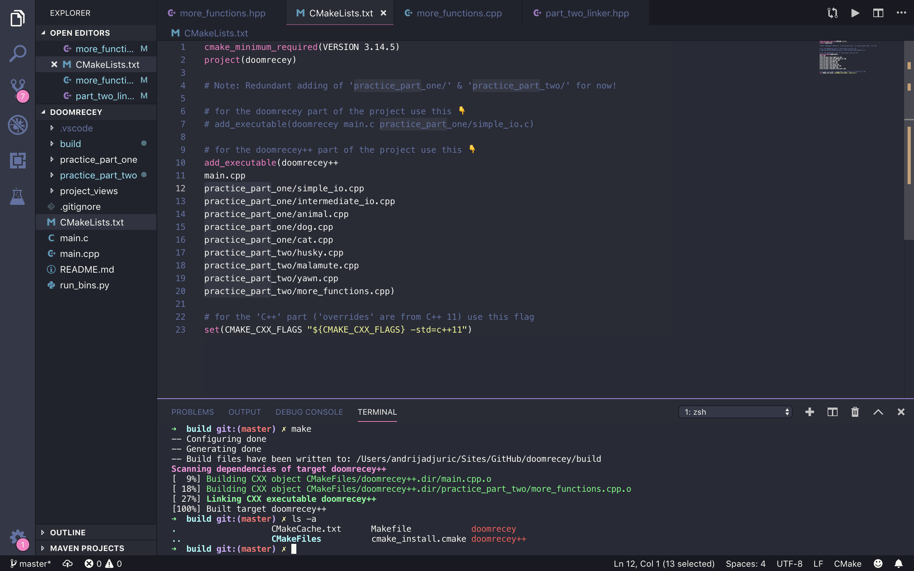

# Doomrecey
<h3>Do more C++ & C.</h3>

<b>This is my old C/C++ playground for personal studying. I'm continuing the study in the TMRG repo/project.</b>

<ul>
  <li>I haven't played with it in a long while.</li>
  <li>Compiling with G++ and GCC.</li>
  <li>Has a small Python script for some simple help.</li>
  <li>Potential unstructured code for practising purposes. <b>Not</b> structured by difficulty.</li>
  <li>Using CMake for building the project.</li>
</ul>

Note #1: Simple compiling reminders.

```
gcc ${array_of_files (.c)} -o doomrecey
```
```
g++ ${array_of_files (.cpp)} -o doomrecey++ (with -std=c++11)
```

Note #2: CMakeLists.txt is added for C and C++ binaries.

Note #3: In the future I'd want to try embedded development with these tools as well (embedded C/C++).

#### Project views:

<h6>CMake Building View &#x2198;</h6>

